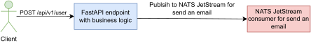

    

<b>talkcorner</b> – forum for communication (backend project based on FastAPI)

---

## Features
- 🤵 User registration, login, getting a list of users, user account confirmation via mail
- 🗨 Creating, reading, updating, deleting (CRUD) forums, subforums, topics and messages for topics

## Using a message broker

    

